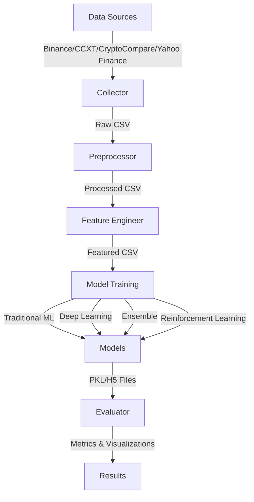

# Bitcoin Price Prediction

A machine learning pipeline for predicting Bitcoin prices using multiple data sources, advanced feature engineering, and diverse model architectures including traditional ML, deep learning, ensemble methods, and reinforcement learning.

## What This Does

- Collects historical Bitcoin price data from multiple sources (Binance, CCXT, CryptoCompare, Yahoo Finance) with automatic fallback
- Engineers 100+ features including technical indicators, price patterns, and market regime detection
- Trains and compares multiple model types: traditional ML (Random Forest, XGBoost, CatBoost, etc.), deep learning (LSTM, GRU), ensemble methods, and reinforcement learning (PPO, A2C)
- Evaluates models using comprehensive metrics (RMSE, MAE, directional accuracy) and generates interactive visualizations
- Provides a modular, extensible pipeline that can run end-to-end or execute individual stages independently

## Architecture



## Key Features

- **Multi-source data collection** with automatic failover
- **Comprehensive feature engineering** (RSI, MACD, Bollinger Bands, ATR, OBV, Ichimoku, and more)
- **Diverse model portfolio** covering traditional ML, deep learning, ensemble, and RL approaches
- **Robust evaluation framework** with multiple metrics and visualization capabilities
- **Modular design** allowing independent execution of pipeline stages
- **Configurable parameters** via centralized configuration file

## Tech Stack

- **Language**: Python 3.8+
- **Data Processing**: pandas, numpy
- **ML Libraries**: scikit-learn, XGBoost, LightGBM, CatBoost
- **Deep Learning**: TensorFlow, Keras
- **Reinforcement Learning**: stable-baselines3, gym
- **Data Sources**: ccxt, python-binance, yfinance, cryptocmd
- **Technical Analysis**: pandas-ta
- **Visualization**: matplotlib, seaborn, plotly
- **Utilities**: requests

## Repository Structure

```
bitcoin_prediction_project/
├── config/
│   └── config.py              # Centralized configuration
├── data/                       # Data storage (CSV files)
├── models/                     # Trained model files (.pkl, .h5)
├── logs/                       # Application logs
├── scripts/                    # Standalone execution scripts
│   ├── engineer_features.py
│   ├── evaluate_models.py
│   ├── preprocess_data.py
│   ├── train_models.py
│   └── visualize_data.py
├── src/                        # Source code modules
│   ├── data/
│   │   ├── collector.py       # Data collection logic
│   │   ├── preprocessor.py    # Data preprocessing
│   │   ├── engineer.py        # Feature engineering
│   │   └── feature_selector.py
│   ├── models/
│   │   ├── traditional.py     # Traditional ML models
│   │   ├── deep_learning.py    # LSTM, GRU models
│   │   ├── ensemble.py        # Ensemble methods
│   │   └── rl.py              # Reinforcement learning
│   ├── evaluation/
│   │   ├── evaluator.py       # Model evaluation
│   │   └── visualizer.py      # Visualization
│   └── utils/
│       └── helpers.py          # Utility functions
├── main.py                     # Main entry point
├── collect_data.py             # Data collection CLI
├── requirements.txt            # Python dependencies
├── test_imports.py             # Import verification script
└── README.md
```

## Quickstart

### Prerequisites

- Python 3.8 or higher
- pip package manager

### Setup

1. Clone the repository:
```bash
git clone <repository-url>
cd bitcoin_prediction_project
```

2. Create a virtual environment (recommended):
```bash
python -m venv venv

# On Windows
venv\Scripts\activate

# On Linux/Mac
source venv/bin/activate
```

3. Install dependencies:
```bash
pip install -r requirements.txt
```

### Run

**Full pipeline** (data collection → preprocessing → feature engineering → training → evaluation → visualization):
```bash
python main.py --mode full
```

**Individual stages**:
```bash
# Data collection only
python main.py --mode collect

# Preprocessing only
python main.py --mode preprocess

# Feature engineering only
python main.py --mode engineer

# Training (all model types)
python main.py --mode train

# Training specific model types
python main.py --mode train-traditional
python main.py --mode train-deep-learning
python main.py --mode train-ensemble

# Evaluation
python main.py --mode evaluate

# Visualization
python main.py --mode visualize --show_plots
```

**Using standalone scripts**:
```bash
# Collect data
python collect_data.py --symbol BTC --quote USD --interval 1d --start_date 2015-01-01

# Preprocess
python scripts/preprocess_data.py

# Engineer features
python scripts/engineer_features.py

# Train models
python scripts/train_models.py --model-type all

# Evaluate models
python scripts/evaluate_models.py

# Visualize
python scripts/visualize_data.py
```

## Configuration

Configuration is managed in `config/config.py`. Key parameters:

| Parameter | Default | Description |
|-----------|---------|-------------|
| `CRYPTO_SYMBOL` | `"BTC"` | Cryptocurrency symbol |
| `QUOTE_CURRENCY` | `"USD"` | Quote currency |
| `TIME_INTERVAL` | `"1d"` | Data interval (1d, 1h, 15m, etc.) |
| `START_DATE` | `"2015-01-01"` | Start date for data collection |
| `TEST_SIZE` | `0.2` | Test set size ratio |
| `VAL_SIZE` | `0.1` | Validation set size ratio |
| `EPOCHS` | `100` | Training epochs for deep learning |
| `BATCH_SIZE` | `64` | Batch size for training |
| `LEARNING_RATE` | `0.001` | Learning rate |
| `RANDOM_STATE` | `42` | Random seed for reproducibility |
| `EARLY_STOPPING_PATIENCE` | `10` | Early stopping patience for deep learning |

Data sources are tried in order: Binance → CCXT → CryptoCompare → Yahoo Finance. No API keys required for default usage.

## Usage

### Command-Line Arguments

**main.py** supports the following arguments:
- `--mode`: Pipeline mode (`full`, `collect`, `preprocess`, `engineer`, `train`, `evaluate`, `visualize`, `train-traditional`, `train-deep-learning`, `train-ensemble`)
- `--symbol`: Cryptocurrency symbol (default: BTC)
- `--quote`: Quote currency (default: USD)
- `--interval`: Time interval (default: 1d)
- `--start_date`: Start date (YYYY-MM-DD)
- `--end_date`: End date (YYYY-MM-DD, defaults to today)
- `--verbose`: Enable verbose logging
- `--show_plots`: Display plots during visualization

**collect_data.py** supports:
- `--symbol`: Cryptocurrency symbol
- `--quote`: Quote currency
- `--interval`: Time interval
- `--start_date`: Start date (YYYY-MM-DD)
- `--end_date`: End date (YYYY-MM-DD)
- `--output`: Output file path
- `--source`: Specific data source (binance, ccxt, cryptocompare, yfinance)
- `--verbose`: Enable verbose output

**scripts/train_models.py** supports:
- `--input`: Input data file path
- `--target`: Target column to predict (default: close)
- `--model-type`: Type of models (`all`, `traditional`, `deep-learning`, `ensemble`)
- `--sequence-length`: Sequence length for sequential models (default: 10)
- `--verbose`: Enable verbose output

### Data Flow

1. **Raw Data**: Collected from exchanges → `data/BTC_USD_1d_raw.csv`
2. **Processed Data**: Cleaned and normalized → `data/BTC_USD_1d_processed.csv`
3. **Featured Data**: With 100+ engineered features → `data/BTC_USD_1d_featured.csv`
4. **Models**: Trained models saved to `models/` directory
5. **Results**: Evaluation metrics and visualizations saved to `results/` directory (if exists)
6. **Logs**: Application logs written to `logs/` directory

### Model Types

- **Traditional ML**: Random Forest, Gradient Boosting, XGBoost, LightGBM, CatBoost
- **Deep Learning**: LSTM, GRU, Bidirectional LSTM
- **Ensemble**: Voting, Stacking, Blending ensembles
- **Reinforcement Learning**: PPO, A2C (trading agents)

## Testing

Basic import testing is available:
```bash
python test_imports.py
```

This verifies that PyTorch and stable-baselines3 can be imported correctly.

## Troubleshooting

**Data collection fails:**
- Check internet connection
- Verify data source APIs are accessible
- Try specifying a different source: `python collect_data.py --source binance` or `--source yfinance`
- Check date ranges are valid

**Model training errors:**
- Ensure sufficient data is available (check `data/` directory)
- Verify featured data exists before training
- Check GPU availability for deep learning models (if using GPU)
- Review logs in `logs/` directory

**Import errors:**
- Ensure virtual environment is activated
- Reinstall dependencies: `pip install -r requirements.txt --upgrade`
- For TA-Lib issues, use pandas-ta (already configured)

**Memory issues:**
- Reduce batch size in `config/config.py`
- Use smaller date ranges for data collection
- Process data in chunks if needed

## License

MIT License - see [LICENSE](LICENSE) file for details.
